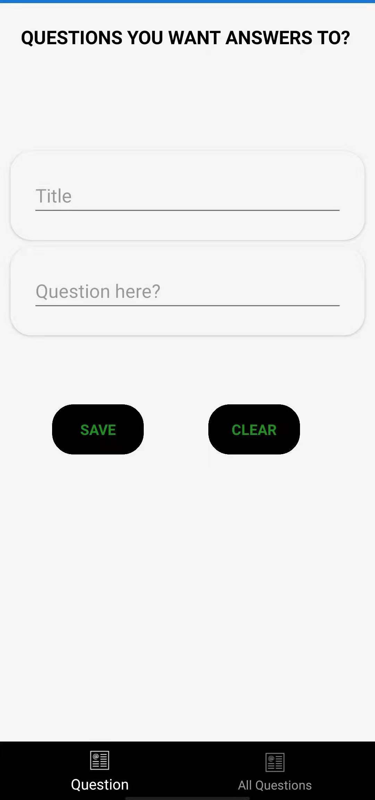
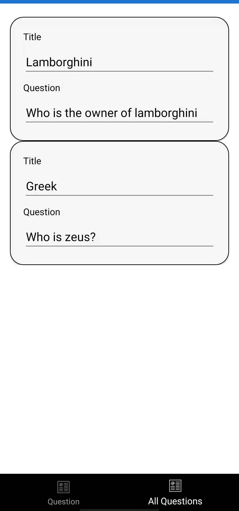
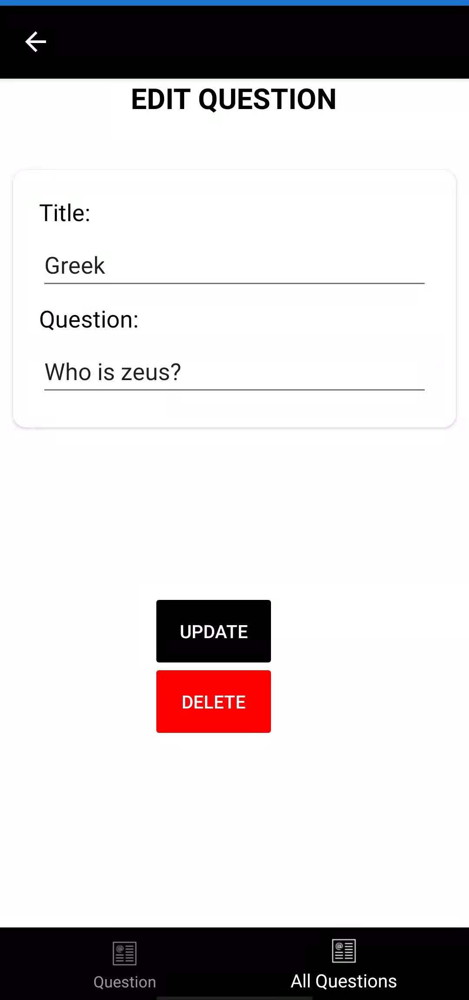

# UnlockTheMinde

Are you busy or tied up?
Imagine you have tones of questions that you would like to research about later after work or school.
This Application lets you save Questions that you can search answers to later when you have free time.

# Basic Features:
- Save Questions you wish to retrieve later
- View all the questions
- Update a question
- Delete a question

## 1. Save Question

## 2. View All Questions

## 3. Update Question

